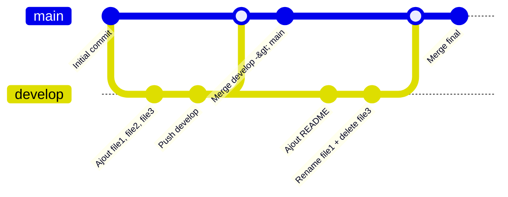

# Projet DevOps

## Description
- gestion de versions
- faire des branches
- merge de code

---

## Installation de Git

```bash
# Vérifier l'installation
git --version

# Installer Git
# https://git-scm.com/
```

## Workflow Git
 

