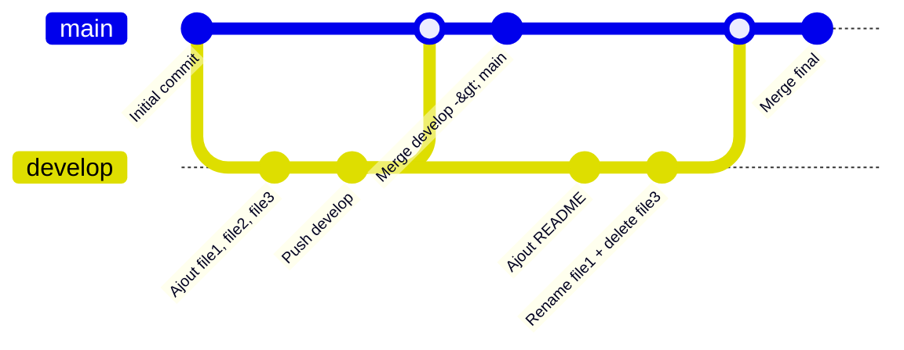

# Projet DevOps

## Description
- gestion de versions
- faire des branches
- merge de code

---

## Installation de Git

```bash
# Vérifier l'installation
git --version

# Installer Git
# https://git-scm.com/
```

## Workflow Git
 


##  Commandes utilisées

| Commande | Description |
|----------|------------|
| `git clone` | Cloner un repository distant en local |
| `git init` | Initialiser un dépôt Git en local |
| `git checkout -b develop` | Créer et se déplacer sur une nouvelle branche |
| `git branch` | Afficher les branches existantes |
| `touch file1` | Créer un fichier |
| `git add .` | Ajouter tous les fichiers à l’index |
| `git commit -m "message"` | Enregistrer les modifications avec un message |
| `git push` | Envoyer les modifications vers GitHub |
| `git push -u origin develop` | Lier et pousser la branche develop |
| `git pull` | Récupérer les modifications distantes |
| `git merge develop` | Fusionner la branche develop dans la branche actuelle |
| `git checkout main` | Se déplacer sur la branche main |
| `mv file1 file1.txt` | Renommer un fichier |
| `rm file3` | Supprimer un fichier |
| `git status` | Voir l’état des fichiers |
| `git log` | Voir l’historique des commits |
